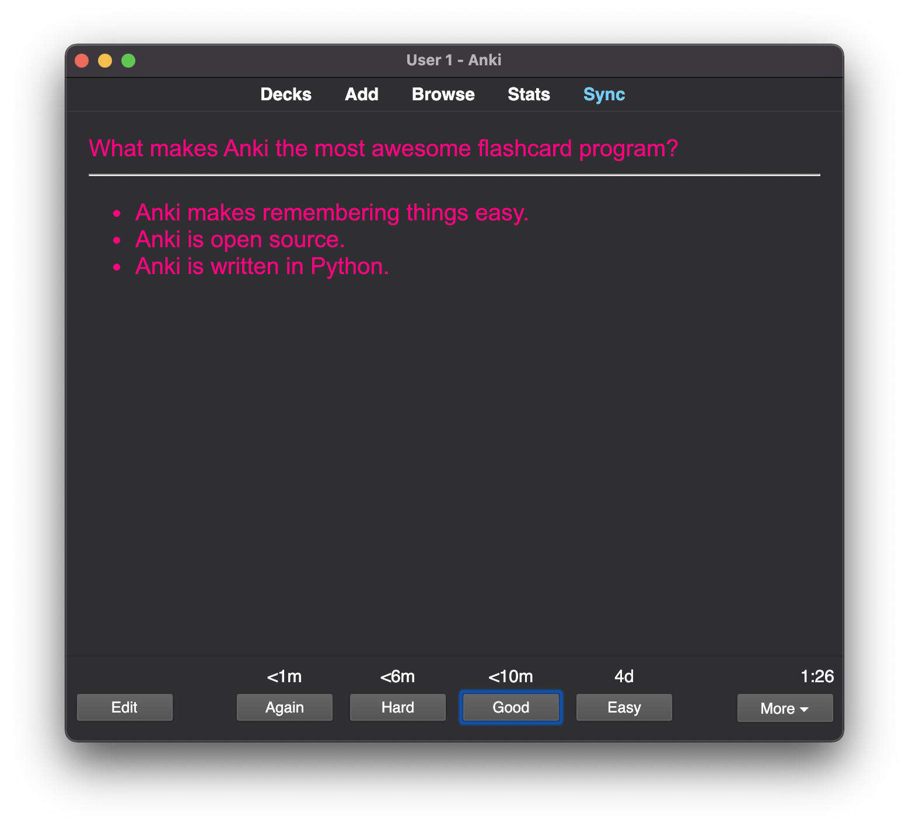
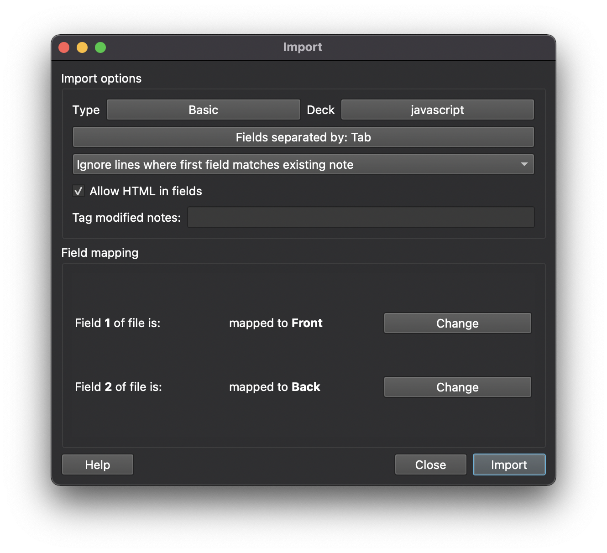

# Anki Card Parser

A python script to parse markdown as basic [Anki](https://apps.ankiweb.net/) flashcards.



## Why

The Anki importer understands html. However, text has to be formated in a specific way. this is necessary to make the importer understand which parts should go on the front and which on the back side of a flashcard. E g. questions and answers have to be wrapped in quotation marks. The importer also requires certain markers signaling the beginning and end of a question.

## How

`Anki Card Parser` assumes your flash cards have a front side containing a question, and a back side containing the answer to that question (cp. screenshot above). It uses an `<h3>` tag as a marker for the begining of a new card. So you can write your markdown like so:

```markdown
### Why is Anki the most awesome flashcard program?

- Anki makes remembering things easy.
- Anki is open Source.
- Anki is written in Python.

### Another question?

Another Answer.
```

### Multiline questions

Sometimes the content of the flashcard's front side cannot be fit into a single line. Let's say you need a code block or an image to illustrate the question. For these cases `Anki Card Parser` uses an optional marker to signal the end of a question. The default is `%eq`.

```markdown
### Why should you not run this piece of bash code:

rm -rf /

%eq

It deletes everything.
```

### Images

`Anki Card Parser` can also handle images. It copies all images from a specified location into Anki's collection. You can add images to your flash cards like so:

```markdown
### Which is the cutest cat in town?

This question is best answered using an image:


<!-- IMAGES CAN ALSO BE ADDED TO THE FRONT SIDE OF FLASHCARDS -->

### Is this the cutest cat in town:


%eq

Yes, it is.
```

## Requirements

`Anki Card Parser` requires `python3`, and the following python packages:

- markdow
- htmlmin
- BeautifulSoup

```bash
pip install markdown htmlmin beautifulsoup4
```

## Installation

Clone this repository.

```bash
git clone https://github.com/xylnx/anki_card_parser.git
```

## Configuration

The script starts with a few variables, which you can adjust according to your needs:

```python
# The path to the library folder of your Anki installation
# Make sure you add the right location here, otherwise copying images won't work
ANKI_LIB_DIR='${HOME}/Library/Application\ Support/Anki2/User\ 1/collection.media'

# The location of the images you want to copy into Anki's library
IMG_DIR='/img/'

# The folder containing parsed markdown files, ready to be imported into Anki
HTML_DIR='/html/'

# Markers signaling the beginning and the end of a question
BEGINN_QUESTION = 'h3'
END_QUESTION = '%eq'
```

To conveniently run the script add this alias to your .bashrc:

```bash
echo 'alias=python3 parse_notes.py ${WORKING_DIR} ${1};' >> ~/.bashrc
```

## Usage

Use the script inside a directory containing the markdown you like to parse. I call mine `notes`. Now create a folder named `html` inside of this directory.

```bash
mkdir -p notes/html
cd notes
```

Now edit a file and run `parseNotes`:

```bash
vim my_notes.md # add your card content
parseNotes my_notes.md
```

As a last step do the following in Anki:

- create a deck (optional)
- press `Import File`
- choose the `text separated by tabs or semicolon` option
- pick the file containing parsed markdown from your html folder => `notes/html`, for example `my_notes.html`
- make sure to set the importer's options like so:
  

- Click `Import`

Time to start studying!
